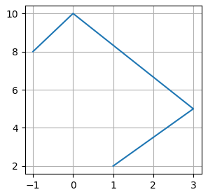

Объявите класс **PolyLine** (полилиния) для представления линии из последовательности прямолинейных сегментов. Объекты этого класса должны создаваться командой:

`poly = PolyLine(start_coord, coord_2, coord_3, ..., coord_N)`

Здесь _start_coord_ - координата начала полилинии (кортеж из двух чисел _x, y_); _coord_2, coord_3, ..._ - последующие координаты точек на плоскости (представленные кортежами), соединенных прямыми линиями.

Например:
```python
poly = PolyLine((1, 2), (3, 5), (0, 10), (-1, 8))
```


В классе **PolyLine** должны быть объявлены следующие методы:

_add_coord(x, y)_ - добавление новой координаты (в конец);  
_remove_coord(indx)_ - удаление координаты по индексу (порядковому номеру, начинается с нуля);  
_get_coords()_ - получение списка координат (в виде списка из кортежей).

P.S. На экран ничего выводить не нужно, только объявить класс.