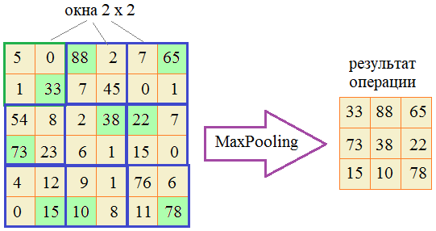
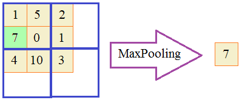

В нейронных сетях использую операцию под названием _Max Pooling_. Суть ее состоит в сканировании прямоугольной таблицы чисел (матрицы) окном определенного размера (обычно, 2x2 элемента) и выбора наибольшего значения в пределах этого окна:
  
 Или, если окна выходят за пределы матрицы, то они пропускаются (игнорируются):
  
Мы повторим эту процедуру. Для этого в программе нужно объявить класс с именем **MaxPooling**, объекты которого создаются командой:

`mp = MaxPooling(step=(2, 2), size=(2,2))`

где _step_ - шаг смещения окна по горизонтали и вертикали;  
_size_ - размер окна по горизонтали и вертикали.

Параметры _step_ и _size_ по умолчанию должны принимать кортеж со значениями (2, 2).

Для выполнения операции Max Pooling используется команда:

`res = mp(matrix)`

где _matrix_ - прямоугольная таблица чисел;  
_res_ - ссылка на результат обработки таблицы _matrix_ (должна создаваться новая таблица чисел.

Прямоугольную таблицу чисел следует описывать вложенными списками. Если при сканировании таблицы часть окна выходит за ее пределы, то эти данные отбрасывать (не учитывать все окно).

Если _matrix_ не является прямоугольной таблицей или содержит хотя бы одно не числовое значение, то должно генерироваться исключение командой:

`raise ValueError("Неверный формат для первого параметра matrix.")`

Пример использования класса (эти строчки в программе писать не нужно):
```python
mp = MaxPooling(step=(2, 2), size=(2,2))
res = mp([[1, 2, 3, 4], [5, 6, 7, 8], [9, 8, 7, 6], [5, 4, 3, 2]])    # [[6, 8], [9, 7]]
```

Результатом будет таблица чисел:

6 8
9 7

P.S. В программе достаточно объявить только класс. Выводить на экран ничего не нужно.