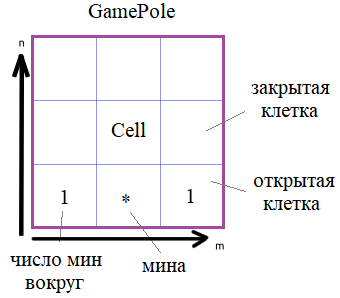

Вы начинаете разрабатывать игру **"Сапер"**. Для этого вам нужно уметь представлять и управлять игровым полем. Будем полагать, что оно имеет размеры _N_ x _M_ клеток. Каждая клетка будет представлена объектом класса **Cell** и содержать либо число мин вокруг этой клетки, либо саму мину.



Для начала в программе объявите класс **GamePole**, который будет создавать и управлять игровым полем. Объект этого класса должен формироваться командой:

`pole = GamePole(N, M, total_mines)`

И, так как поле в игре одно, то нужно контролировать создание только одного объекта класса **GamePole** (используйте паттерн _Singleton_, о котором мы с вами говорили, когда рассматривали магический метод ___new__()_).

Объект _pole_ должен иметь локальный приватный атрибут:

___pole_cells_ - двумерный (вложенный) кортеж, размерами _N_ x _M_ элементов (N строк и M столбцов), состоящий из объектов класса **Cell**.

Для доступа к этой коллекции объявите в классе **GamePole** объект-свойство (property):

_pole_ - только для чтения (получения) ссылки на коллекцию ___pole_cells_.

Далее, в самом классе **GamePole** объявите следующие методы:

_init_pole()_ - для инициализации начального состояния игрового поля (расставляет мины и делает все клетки закрытыми);  
_open_cell(i, j)_ - открывает ячейку с индексами (_i, j_); нумерация индексов начинается с нуля; метод меняет значение атрибута ___is_open_ объекта **Cell** в ячейке (_i, j_) на _True_;  
_show_pole()_ - отображает игровое поле в консоли (как именно сделать - на ваше усмотрение, этот метод - домашнее задание).

Расстановку мин выполняйте случайным образом по игровому полю (для этого удобно воспользоваться функцией _randint_ модуля _random_). После расстановки всех _total_mines_ мин, вычислите их количество вокруг остальных клеток (где нет мин). Область охвата - соседние (прилегающие) клетки (8 штук).

В методе _open_cell()_ необходимо проверять корректность индексов (_i, j_). Если индексы указаны некорректно, то генерируется исключение командой:
```python
raise IndexError('некорректные индексы i, j клетки игрового поля')
```
Следующий класс **Cell** описывает состояние одной ячейки игрового поля. Объекты этого класса создаются командой:

`cell = Cell()`

При этом в самом объекте создаются следующие локальные приватные свойства:

___is_mine_ - булево значение _True/False_; _True_ - в клетке находится мина, _False_ - мина отсутствует;  
___number_ - число мин вокруг клетки (целое число от 0 до 8);  
___is_open_ - флаг того, открыта клетка или закрыта: _True_ - открыта; _False_ - закрыта.

Для работы с этими приватными атрибутами объявите в классе **Cell** следующие объекты-свойства с именами:

_is_mine_ - для записи и чтения информации из атрибута ___is_mine_;
_number_ - для записи и чтения информации из атрибута ___number_;
_is_open_ - для записи и чтения информации из атрибута ___is_open_.

В этих свойствах необходимо выполнять проверку на корректность переданных значений (либо булево значение **True/False**, либо целое число от 0 до 8). Если передаваемое значение некорректно, то генерировать исключение командой:
```python
raise ValueError("недопустимое значение атрибута")
```
С объектами класса **Cell** должна работать функция:

`bool(cell)`

которая возвращает _True_, если клетка закрыта и _False_ - если открыта.

Пример использования классов (эти строчки в программе писать не нужно):
```python
pole = GamePole(10, 20, 10)  # создается поле размерами 10x20 с общим числом мин 10
pole.init_pole()
if pole.pole[0][1]:
    pole.open_cell(0, 1)
if pole.pole[3][5]:
    pole.open_cell(3, 5)
pole.open_cell(30, 100)  # генерируется исключение IndexError
pole.show_pole()
```
P.S. В программе на экран выводить ничего не нужно, только объявить классы.