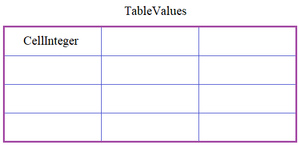

Вам необходимо написать программу для удобного обращения с таблицами однотипных данных (чисел, строк, булевых значений и т.п.), то есть, все ячейки таблицы должны представлять какой-то один указанный тип.
  
Для этого в программе необходимо объявить три класса:

**TableValues** - для работы с таблицей в целом;  
**CellInteger** - для операций с целыми числами;  
**IntegerValue** - дескриптор данных для работы с целыми числами.

Начнем с дескриптора **IntegerValue**. Это должен быть дескриптор данных (то есть, и для записи и считывания значений). Если присваиваемое значение не является целым числом, должно генерироваться исключение командой:
```python
raise ValueError('возможны только целочисленные значения')
```
Следующий класс **CellInteger** описывает одну ячейку таблицы для работы с целыми числами. В этом классе должен быть публичный атрибут (атрибут класса):
```python
value - объект дескриптора, класса IntegerValue.
```
А объекты класса **CellInteger** должны создаваться командой:
```python
cell = CellInteger(start_value)
```
где _start_value_ - начальное значение ячейки (по умолчанию равно 0 и сохраняется в ячейке через дескриптор _value_).

Наконец, объекты последнего класса **TableValues** создаются командой:
```python
table = TableValues(rows, cols, cell=CellInteger)
```
где _rows, cols_ - число строк и столбцов (целые числа);  
_cell_ - ссылка на класс, описывающий работу с отдельными ячейками таблицы.  
Если параметр _cell_ не указан, то генерировать исключение командой:
```python
raise ValueError('параметр cell не указан')
```
Иначе, в объекте table класса **TableValues** создается двумерный (вложенный) кортеж с именем _cells_ размером _rows x cols_, состоящий из объектов указанного класса (в данном примере - класса **CellInteger**).

Также в классе **TableValues** предусмотреть возможность обращения к отдельной ячейке по ее индексам, например:
```python
value = table[1, 2] # возвращает значение ячейки с индексом (1, 2)
table[0, 0] = value # записывает новое значение в ячейку (0, 0)
```
Обратите внимание, по индексам сразу должно возвращаться значение ячейки, а не объект класса **CellInteger**. И то же самое с присваиванием нового значения.

Пример использования классов (эти строчки в программе не писать):
```python
table = TableValues(2, 3, cell=CellInteger)
print(table[0, 1])
table[1, 1] = 10
table[0, 0] = 1.45 # генерируется исключение ValueError

# вывод таблицы в консоль
for row in table.cells:
    for x in row:
        print(x.value, end=' ')
    print()
```
P.S. В программе нужно объявить только классы. Выводить на экран ничего не нужно.

P.P.S. В качестве домашнего задания создайте класс **CellString** для работы со строками и используйте тот же класс **TableValues** для этого нового типа данных.

Последнее: дескрипторы здесь для повторения. В реальной разработке лучше использовать в таких задачах объекты-свойства (property).