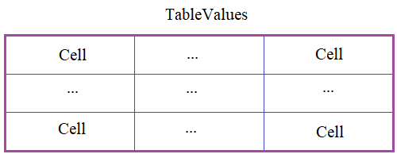

В программе необходимо реализовать таблицу **TableValues** по следующей схеме:

Каждая ячейка таблицы должна быть представлена классом **Cell**. Объекты этого класса создаются командой:

`cell = Cell(data)`

где _data_ - данные в ячейке. В каждом объекте класса **Cell** должен формироваться локальный приватный атрибут ___data_ с соответствующим значением. Для работы с ним в классе **Cell** должно быть объект-свойство (_property_):

_data_ - для записи и считывания информации из атрибута ___data_.

Сам класс **TableValues** представляет таблицу в целом, объекты которого создаются командой:

`table = TableValues(rows, cols, type_data)`

где _rows, cols_ - число строк и столбцов таблицы;  
_type_data_ - тип данных ячейки (_int_ - по умолчанию, _float, list, str_ и т.п.). Начальные значения в ячейках таблицы равны _0_ (целое число).

С объектами класса **TableValues** должны выполняться следующие команды:
```python
table[row, col] = value# запись нового значения в ячейку с индексами row, col (индексы отсчитываются с нуля)
value = table[row, col] # считывание значения из ячейки с индексами row, col

for row in table:  # перебор по строкам
    for value in row: # перебор по столбцам
        print(value, end=' ')  # вывод значений ячеек в консоль
    print()
```
При попытке записать по индексам _table[row, col]_ данные другого типа (не совпадающего с атрибутом _type_data_ объекта класса **TableValues**), должно генерироваться исключение командой:
```python
raise TypeError('неверный тип присваиваемых данных')
```
При работе с индексами _row, col_, необходимо проверять их корректность. Если индексы не целое число или они выходят за диапазон размера таблицы, то генерировать исключение командой:
```python
raise IndexError('неверный индекс')
```
P.S. В программе нужно объявить только классы. Выводить на экран ничего не нужно.