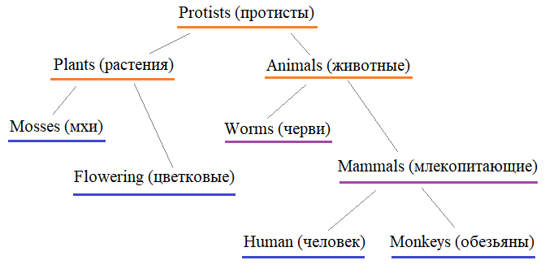

Объявите в программе следующие классы без содержимого (используйте оператор pass):

**Protists, Plants, Animals, Mosses, Flowering, Worms, Mammals, Human, Monkeys**

и постройте схему наследования в соответствии со следующей иерархией древа жизни:

Затем, объявите в программе классы:

**Monkey** - наследуется от **Monkeys** и служит для описания обезьян;  
**Person** - наследуется от **Human** и служит для описания человека;  
**Flower** - наследуется от **Flowering** и служит для описания цветка;  
**Worm** - наследуется от **Worms** и служит для описания червей.

Объекты этих классов должны создаваться командами:
```python
obj = Monkey(name, weight, old)
obj = Person(name, weight, old)
obj = Flower(name, weight, old)
obj = Worm(name, weight, old)
```
где _name_ - наименование (или имя) объекта (строка);  
_weight_ - вес (вещественное число);  
_old_ - возраст (целое число).  
В каждом объекте любого из этих классов должны создаваться соответствующие атрибуты: _name, weight, old_.

Создайте в программе следующие объекты и сохраните их в виде списка _lst_objs_:
```python
Monkey: "мартышка", 30.4, 7
Monkey: "шимпанзе", 24.6, 8
Person: "Балакирев", 88, 34
Person: "Верховный жрец", 67.5, 45
Flower: "Тюльпан", 0.2, 1
Flower: "Роза", 0.1, 2
Worm: "червь", 0.01, 1
Worm: "червь 2", 0.02, 1
```
Затем, используя функции `isinstance()` и генератор списков _(List comprehensions)_, сформируйте следующие списки из указанных объектов:

_lst_animals_ - все объекты, относящиеся к животным (**Animals**);  
_lst_plants_ - все объекты, относящиеся к растениям (**Plants**);  
_lst_mammals_ - все объекты, относящиеся к млекопитающим (**Mammals**).

P.S. В программе на экран выводить ничего не нужно.!